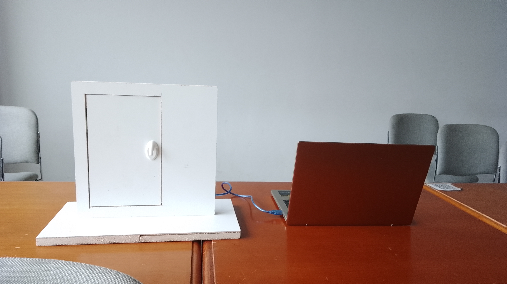
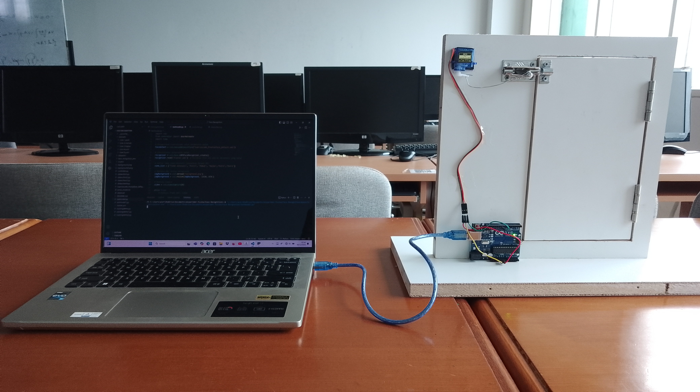

# 🔐 Face Recognition Door Lock System  
**Smart Door Security Using Computer Vision and Arduino**

---

## 📌 Overview
This project presents a **face recognition–based automatic door lock system** designed to improve security by allowing access only to authorized users.  
The system combines **computer vision using OpenCV** and **hardware control using Arduino UNO** to create a real-time smart security solution.

This project demonstrates practical skills in **Python programming, image processing, IoT integration, and system implementation**, making it suitable for professional portfolios and technical evaluations.

---

## 🎯 Objectives
- Implement a face recognition system for door access control  
- Integrate software-based facial recognition with physical door locking mechanisms  
- Enhance security through user authentication  
- Demonstrate real-world application of computer vision and IoT  

---

## 🛠 Tools & Materials

### Software
- Python  
- OpenCV  
- Visual Studio Code  

### Hardware
- Laptop  
- Arduino UNO  
- Webcam  
- Servo Motor (SG90)  
- Door Lock  
- Jumper Wires  
- Connecting Wires  

---

## ⚙️ System Workflow
1. Prepare the required tools and materials, including installing the necessary software (Python, OpenCV, etc.).
2. Capture face images of registered users using the webcam.
3. Store the captured face images into a dataset for training.
4. Develop the face recognition program step-by-step in Python using OpenCV.
5. Train the face recognition model using the prepared face dataset.
6. Build the automatic door-lock hardware circuit according to the designed prototype (Arduino UNO + SG90 servo + door lock).
7. Integrate the face recognition program with the hardware system so the recognition result can trigger the door lock mechanism.
8. Test the system: if the face is recognized with sufficient confidence/accuracy, Arduino drives the servo to unlock; otherwise the door remains locked. 

---

## 🧠 Face Recognition Approach
- **Face Detection:** Uses **Haar Cascade Classifier** to detect and locate a face region (ROI) in each video frame.
- **Dataset-Based Training:** Builds a labeled dataset from registered users’ face images, then trains the recognition model.
- **Face Recognition:** Uses **LBPH (Local Binary Pattern Histogram)** to extract local facial texture patterns and compare them with trained data for identity recognition.
- **Real-Time Testing:** Runs recognition in real time and evaluates the recognition result (accuracy/confidence) before granting access.
- **Arduino Integration:** Sends the recognition decision to **Arduino UNO** to control the **SG90 servo** for door unlocking/locking. 

---

## 🖼️ System Design and Prototype

### 🔹 System Design

### 🔹 Prototype

---

## 📚 Project Report Documentation
For the complete project report, documentation files, and supporting materials, see:  
📄 **[Project Report & Documentation (Google Drive)](https://drive.google.com/drive/folders/1YIdJaXm3H0nIeaL4jFSyB7th1t3a5bjC)**

---

## 🚀 How to Use
1. Install required Python libraries  
2. Capture facial datasets using the webcam  
3. Train the face recognition model  
4. Run the recognition system  
5. Connect Arduino to activate the servo motor for door locking  

---

## 📊 Results
- The system successfully recognizes registered users  
- The door unlocks automatically for authorized access  
- Unregistered faces are denied entry  
- Real-time performance suitable for prototype-level security systems  

---

## 👩‍💻 Author
**Putri Aurelia**  

🔗 LinkedIn:  
[Putri Aurelia](https://www.linkedin.com/in/putri-aurelia-728abb342/)
