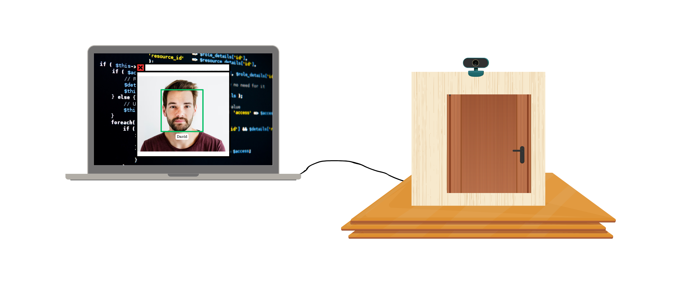
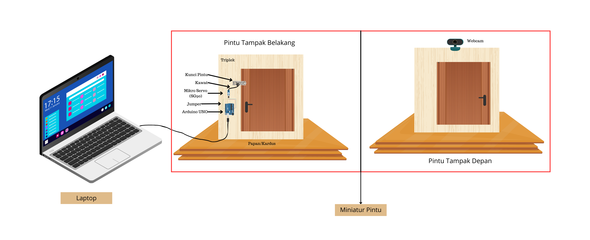

# 🔐 Face Recognition Door Lock System  
**Smart Door Security Using Computer Vision and Arduino**

---

## 📌 Overview
This project presents a **face recognition–based automatic door lock system** designed to improve security by allowing access only to authorized users.  
The system combines **computer vision using OpenCV** and **hardware control using Arduino UNO** to create a real-time smart security solution.

This project demonstrates practical skills in **Python programming, image processing, IoT integration, and system implementation**, making it suitable for professional portfolios and technical evaluations.

---

## 🎯 Objectives
- Implement a face recognition system for door access control  
- Integrate software-based facial recognition with physical door locking mechanisms  
- Enhance security through user authentication  
- Demonstrate real-world application of computer vision and IoT  

---

## 🛠 Tools & Materials

### Software
- Python  
- OpenCV  
- Visual Studio Code  

### Hardware
- Laptop  
- Arduino UNO  
- Webcam  
- Servo Motor (SG90)  
- Door Lock  
- Jumper Wires  
- Connecting Wires  

---

## ⚙️ System Workflow
1. The webcam captures facial images in real time  
2. OpenCV detects and recognizes the face  
3. The system checks whether the face is registered  
4. If the face is recognized, the servo motor unlocks the door  
5. If the face is not recognized, access is denied  

---

## 🧠 Face Recognition Approach
- Face detection using **Haar Cascade Classifier**  
- Dataset-based facial training  
- Real-time face recognition testing  
- Integration with Arduino for hardware control  

---

## 🖼️ System Design and Prototype

### 🔹 System Integration Design

### 🔹 Prototype Layout (Front and Back View)

---

## 📚 Project Report Documentation
For the complete project report, documentation files, and supporting materials, see:  
📄 **[Project Report & Documentation (Google Drive)](https://drive.google.com/drive/folders/1YIdJaXm3H0nIeaL4jFSyB7th1t3a5bjC)**

---

## 🚀 How to Use
1. Install required Python libraries  
2. Capture facial datasets using the webcam  
3. Train the face recognition model  
4. Run the recognition system  
5. Connect Arduino to activate the servo motor for door locking  

---

## 📊 Results
- The system successfully recognizes registered users  
- The door unlocks automatically for authorized access  
- Unregistered faces are denied entry  
- Real-time performance suitable for prototype-level security systems  

---

## 👩‍💻 Author
**Putri Aurelia**  
Physics Undergraduate | Computer Vision | IoT & Data Analysis  

🔗 LinkedIn:  
[https://www.linkedin.com/in/putri-aurelia-83087b343/](https://www.linkedin.com/in/putri-aurelia-83087b343/)

---

## 📄 Notes
This project is developed for **educational, experimental, and portfolio purposes** and demonstrates the integration of artificial intelligence with embedded systems.
